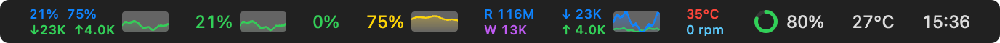
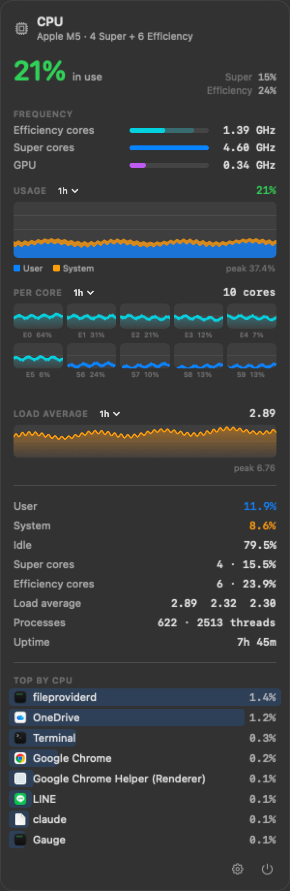
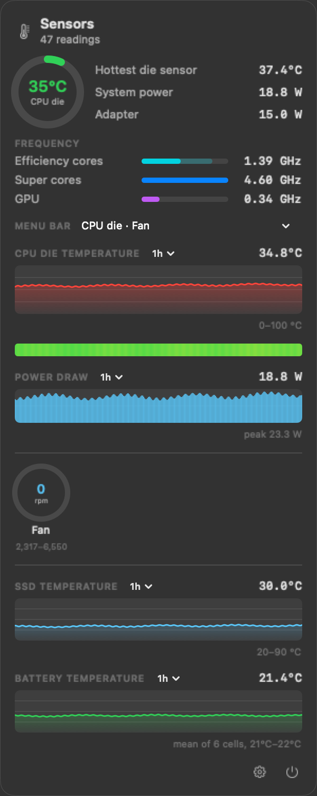
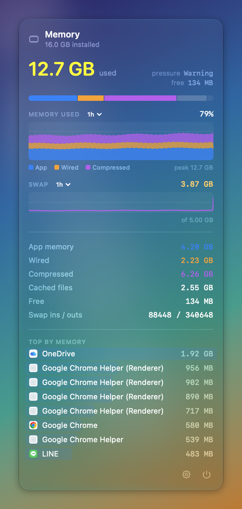
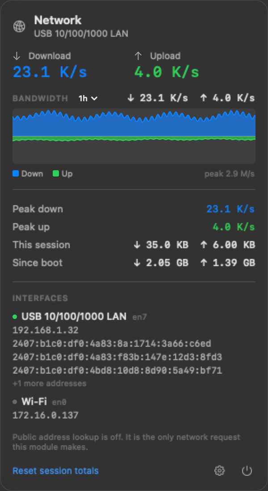
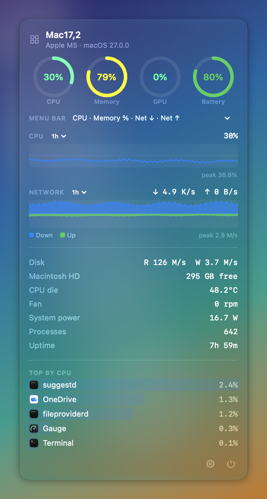
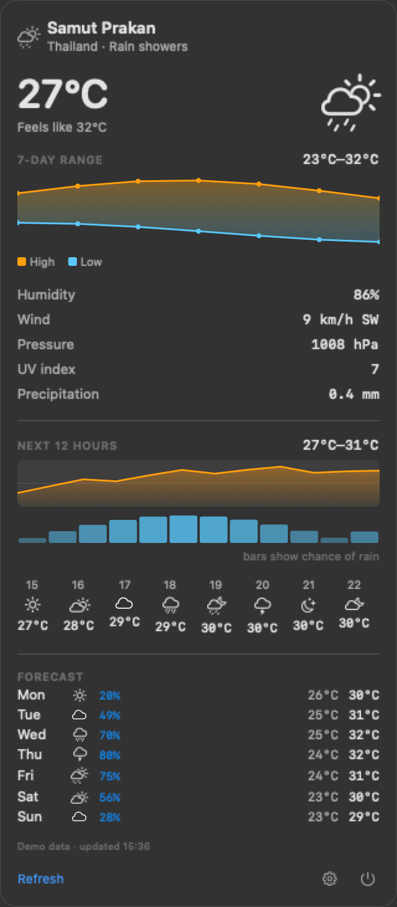
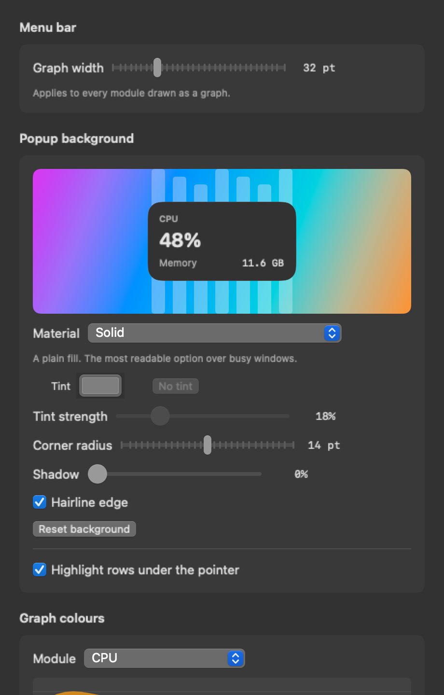
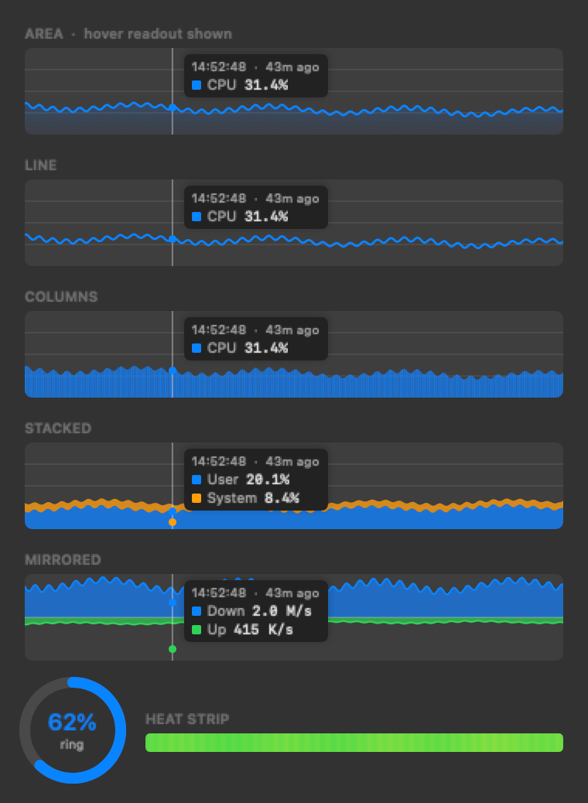

# Gauge

A menu bar system monitor for macOS. Everything it shows is read from the
machine it runs on; nothing leaves that machine unless you switch it on.

**Wefreefly** · [wefreefly@thaisimply.com](mailto:wefreefly@thaisimply.com) · Built with Claude Code
· [อ่านภาษาไทย](README.th.md)



---

## What it does

Ten modules, each with its own menu bar item and its own dropdown. Pick the
ones you want; the rest stay out of the way.

| Module | What it reports |
|---|---|
| **CPU** | Total and per-core load, split by cluster, user vs system, load average, uptime, process and thread counts, clock speeds, top processes |
| **GPU** | Device, renderer and tiler utilisation, memory in use |
| **Memory** | App, wired, compressed and cached, memory pressure, swap, page-ins and outs, top processes |
| **Disks** | Capacity per mounted volume, read and write throughput, totals since boot |
| **Network** | Live throughput, peaks, session and boot totals, every interface with its addresses, optional public IP |
| **Sensors** | CPU die temperature and the hottest single sensor, cluster clock speeds, fans with their operating range, system and adapter power, SSD and battery temperature |
| **Battery** | Charge, health, cycle count, real capacity in mAh, voltage, current, temperature, time remaining |
| **Time** | A clock you can format, plus world clocks |
| **Weather** | Current conditions, hourly and seven-day forecast — **off by default** |
| **Combined** | One item standing in for several |

Each menu bar item draws as text, a graph, both, a ring gauge, or an icon.

## Screenshots

| | |
|---|---|
|  |  |
| **CPU** — stacked user/system history, a miniature graph per core coloured by cluster, load average | **Sensors** — die temperature with a thermal strip, cluster clock speeds, fans, SSD and battery temperature |
|  |  |
| **Memory** — the breakdown stacked over time, swap, top processes with their real icons | **Network** — download above the line and upload below, every interface and address |
|  |  |
| **Combined** — one item in place of several | **Weather** — off until switched on, and the only thing here that leaves the machine |
|  | |
| **Appearance** — colours, fill style and the Liquid Glass background, previewed live | |



The panel screenshots are real captures of the Liquid Glass (clear) material
over a fixed backdrop — `./Scripts/screenshots.sh` regenerates them. Glass is
composited by the window server and comes out empty in an offscreen render,
so each panel is put on screen and captured by window id.

Hovering any history graph shows a crosshair with the time, how long ago it
was, and every series' value at that point. Each graph has its own range menu:
10 minutes, 1, 3, 6 or 12 hours, or 1, 3, 7, 14 or 28 days.

## Install

Grab `Gauge-1.0.dmg` or `Gauge-1.0.pkg` from `package/`, or build them:

```bash
./Scripts/package.sh
open package/
```

| | |
|---|---|
| **`Gauge-1.0.dmg`** | Drag Gauge onto the Applications shortcut beside it |
| **`Gauge-1.0.pkg`** | Double-click and follow the installer |

Both are signed with a Developer ID and notarised by Apple, so they open
normally — no right-click, no warning.

### Signing and notarisation

`build.sh` finds a **Developer ID Application** certificate and signs with the
hardened runtime and a secure timestamp. `package.sh` signs the installer with
a **Developer ID Installer** certificate and, given a notarytool profile,
notarises and staples three things: the app, the disk image and the package.

```bash
xcrun notarytool store-credentials gauge \
      --apple-id you@example.com --team-id TEAMID --password <app-specific-password>

GAUGE_NOTARY_PROFILE=gauge ./Scripts/package.sh
```

The app is notarised before it goes into either container. Stapling only the
disk image is enough while the Mac can reach Apple; a ticket on the app itself
travels with it once it is dragged to Applications, so a first launch works
with no network at all.

Gauge declares **no entitlements** and needs no capabilities, so nothing has
to be registered beyond the two certificates. Apple's Developer ID
intermediate is not shipped with macOS — without it a correctly issued
certificate imports and then reports `CSSMERR_TP_NOT_TRUSTED`, which reads
like a mismatched key and is not one.

Without a certificate the build falls back to an ad-hoc signature. That runs
fine locally, but on another Mac the first launch needs a right-click →
**Open**, or:

```bash
xattr -dr com.apple.quarantine /Applications/Gauge.app
```

### Uninstall

Run `Uninstall Gauge.command` from the disk image, or `./Scripts/uninstall.sh`.
It lists what it is about to delete — the app, preferences, the history file,
caches, the keychain entry and any login item — and waits for a yes.

## Privacy

This is the part that differs most from the commercial alternatives.

**By default Gauge makes no network requests at all.** No licence check, no
update check, no analytics, no crash reporting. Two features can reach the
network, and both are off until switched on:

- **Weather** sends the coordinates you choose to a weather service. The
  default provider is [Open-Meteo](https://open-meteo.com), which needs no
  account and carries no per-user identifier. AccuWeather is available as an
  alternative; its API key is kept in the login keychain, not in preferences.
  Gauge never asks for Location Services — you type a city name.
- **Public IP lookup** asks a configurable endpoint for your address, at most
  every 15 minutes.

Weather is not needed to monitor a machine. It is the one feature that forces
an outside connection and reveals a location, which is why it is opt-in rather
than bundled in with everything else.

Nothing runs as root. There is no helper daemon and no installed privileged
component.

## Where the numbers come from

| Reading | Source |
|---|---|
| CPU, memory | Mach `host_processor_info` and `host_statistics64` |
| Processes | `libproc` — `proc_listpids`, `proc_pid_rusage` |
| GPU | IORegistry `IOAccelerator` performance statistics |
| Disks | `IOBlockStorageDriver` counters and `URLResourceValues` |
| Network | Routing-socket `NET_RT_IFLIST2` and `SCDynamicStore` |
| Temperatures | `IOHIDEventSystemClient` on Apple Silicon, SMC keys on Intel |
| Fans, power | SMC, through a local IOKit connection |
| Battery | `IOPowerSources`, `AppleSmartBattery` and the SMC gas gauge |
| CPU/GPU clocks | `IOReport` DVFS residency × the state tables in the power manager |

## Measured, not guessed

Two things here were worked out by experiment rather than assumed, because
assuming would have produced numbers that looked right and were wrong.

### Which sensors are the CPU

Apple documents nothing about a sensor named `PMU tdie7`. Gauge loads one core
cluster at a time — thread QoS is the lever; background work is confined to
the efficiency cores — and records which sensors respond. On a Mac17,2 (M5):

| Sensors | Δ under efficiency load | Δ under performance load | Verdict |
|---|---|---|---|
| `PMU tdie1–14` | +6.9 to +13.3 °C | +8.5 to +19.5 °C | the compute die |
| `PMU2 tdie1–10` | +0.2 to +1.0 °C | +0.9 to +1.3 °C | not the CPU |
| `NAND CH0` | +3.0 °C | −2.3 °C | the SSD |

Averaging the second group into the CPU reading, which an earlier version did,
under-reported it by 6–8 °C.

**Settings → Sensors → Calibrate** runs this on your own Mac and relabels the
sensors by the cluster they follow. It is an affinity, not a per-core mapping:
heat spreads across a die, so every sensor on it responds to both clusters.

Cluster names come from the system — `hw.perflevel0.name`, which on an M5 reads
**Super** rather than **Performance** — and each core's cluster from
`cluster-type` in the device tree, not from an assumed ordering.

### Clock speeds

Apple Silicon publishes no current frequency. It publishes how long each
cluster spent in each DVFS state; multiplied by the power manager's state
tables that gives the average clock over the sampling interval. The average is
taken over the states that are not idle — a machine doing nothing is not a
machine with a slow clock — and a cluster that never left idle reports `idle`
rather than 0 GHz.

## History

Twenty-eight days at two-second resolution would be 1.2 million samples per
metric, so history is kept at three resolutions, each bucket holding the
minimum, mean and maximum:

| Tier | Resolution | Span | Used for |
|---|---|---|---|
| live | 2 s | 1 hour | 10m, 1h |
| minute | 1 min | 25 hours | 3h, 6h, 12h, 1d |
| quarter | 15 min | 28 days | 3d, 7d, 14d, 28d |

About 2.5 MB in memory for all metrics. The two coarse tiers are written to
`~/Library/Application Support/Gauge/history.gauge` every minute and at quit,
which is what makes a range of days mean anything after a restart. Gaps — the
machine asleep, or the app not running — stay gaps rather than being drawn as
zero.

## Performance

Idle cost is around **1% of one core and 25 MB**, measured with `--bench`:

| Collector | Panel open | Idle |
|---|---|---|
| Sensors | 43 ms | 16 ms every 4 s |
| Network | 13.6 ms | 1.3 ms |
| Disk | 6.2 ms | 0.07 ms |
| GPU | 0.8 ms | 0.8 ms |
| CPU + memory | 0.01 ms | 0.01 ms |
| History write, 28 metrics | 0.01 ms | 0.01 ms |

The slow collectors run at their own cadence when no dropdown is open, service
names and addresses are cached, and a menu bar item is not redrawn when nothing
about it changed — AppKit rebuilds the item's snapshot on every image it is
handed.

## Building from source

Needs only the **Command Line Tools** (`xcode-select --install`). A full Xcode
install is not required.

```bash
./build.sh                                 # build and assemble Gauge.app
swift run GaugeTests                       # the test suite
./Scripts/package.sh                       # build, then a .dmg and a .pkg
```

The built app goes to `~/.cache/gauge-build/out/`, outside the project, because
this tree lives in a synced folder and a ten-megabyte bundle rewritten on every
build gives the sync client nothing useful to do. Installers land in `package/`,
where they are easy to find.

### Diagnostics

```bash
APP=~/.cache/gauge-build/out/Gauge.app/Contents/MacOS/Gauge
$APP --dump              # one sampling pass, printed
$APP --bench             # time every collector
$APP --history-stats     # how much data each range holds
$APP --map-sensors --save   # calibrate the thermal sensors (~2 minutes)
$APP --weather "Bangkok"    # check the weather provider end to end
$APP --panel sensors 20     # put one dropdown on screen
$APP --preview ./out --demo # render every panel and menu bar style to PNG
```

### Three constraints worth knowing

1. **`@State` is unavailable.** In the macOS 26 SDK it is a macro whose plugin
   ships only with Xcode. Local view state uses a small `ObservableObject` box
   with `@StateObject`, which has the same lifetime and gives the same
   `Binding`. Every other property wrapper works.
2. **No XCTest.** It also ships with Xcode. The suite is an ordinary executable
   with its own harness: `swift run GaugeTests`, exit 0 when everything passes.
   Currently 1301 checks.
3. **The SMC request struct has to stay in C.** The user client expects exactly
   80 bytes; Swift lays the same fields out as 76 by packing into a nested
   struct's tail padding, and every call is silently rejected.

Two more that cost real time:

4. **Dropdowns are not `NSPopover`.** A popover paints its own opaque frame over
   anything the content puts behind itself, Liquid Glass included. They are
   borderless panels, which also gives control of the corner radius and shadow.
5. **The installer must not relocate.** `pkgbuild` marks app bundles relocatable
   by default, and after the bundle identifier changed, PackageKit moved a new
   install into `/Applications/Gauge.localized/` rather than replacing the old
   one. The component is now built with `BundleIsRelocatable` false and the
   packaging script verifies it.

## Not done

- **Fan control.** Reading and writing SMC keys is implemented, but writing the
  fan target needs privileges the app does not have — that means installing a
  root helper, which is the thing this deliberately avoids.
- **Notification rules**, of the "tell me when the CPU is over 90% for a minute"
  kind.
- **Reordering menu bar items by dragging.** The order is stored; there is no
  drag handle yet.

## Licence

[Apache License 2.0](LICENSE). Copyright 2026 Wefreefly.

You may use, modify and redistribute this, including commercially, provided
you keep the licence and notice and state what you changed. It also grants a
patent licence from the contributors, which is the main thing it adds over
MIT. It comes with no warranty.

Not affiliated with the Apache Software Foundation — the licence is simply the
terms this is offered under.
